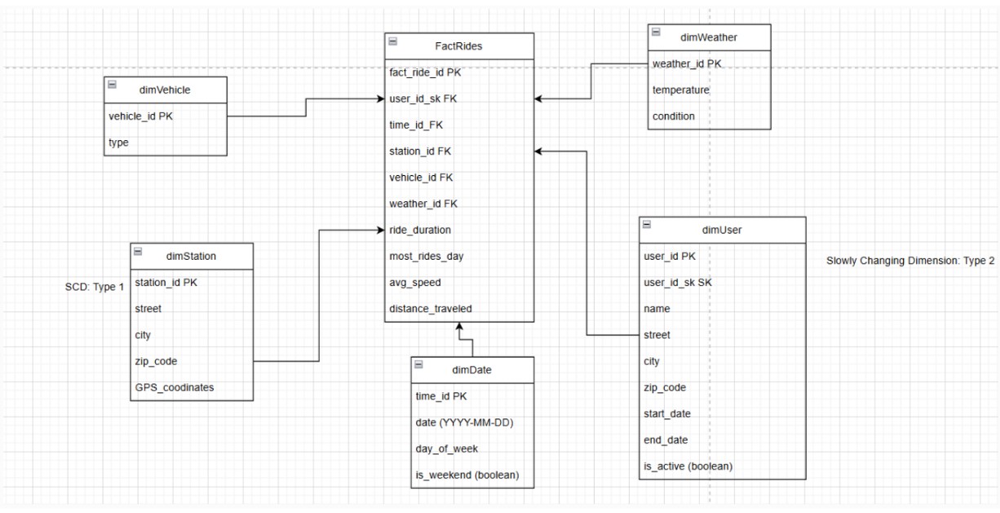

# Bike-Sharing Data Warehouse with PySpark & Delta Lake

> **Building a scalable, star-schema data warehouse for bike-sharing analytics using modern big data technologies**

A production-grade data warehouse implementation that transforms raw transactional data from a bike-sharing system into an optimized analytical database. Built with PySpark and Delta Lake, this project demonstrates end-to-end ETL pipeline design, dimensional modeling, and big data engineering best practices.

[](https://spark.apache.org/)
[](https://delta.io/)
[](https://www.postgresql.org/)
[](https://www.python.org/)

---

## Project Overview

### The Business Problem

Bike-sharing systems generate massive amounts of transactional data daily: ride details, user subscriptions, station availability, and environmental conditions. This data, when properly organized, can unlock critical insights for:

- **Operational Optimization**: Identify high-demand stations and optimal bike redistribution strategies
- **User Analytics**: Understand usage patterns, peak times, and customer behavior
- **Predictive Maintenance**: Track vehicle usage and predict maintenance needs
- **Business Intelligence**: Measure revenue, subscription trends, and geographic expansion opportunities

**Challenge**: Raw operational data is scattered across multiple tables, unnormalized, and not optimized for analytical queries.

**Solution**: Build a dimensional data warehouse using star schema design that enables fast, flexible analytics.

### What This Project Delivers

 **Star Schema Data Warehouse** with 5 dimension tables and 1 fact table  
 **ETL Pipelines** that extract from PostgreSQL, transform with PySpark, and load to Delta Lake  
 **Geospatial Analytics** with Haversine distance calculations for ride routes  
 **Temporal Analytics** with comprehensive date dimension (2009-2023)  
 **Scalable Architecture** using distributed processing with Spark  
 **ACID Transactions** leveraging Delta Lake for data reliability  

---

## Architecture

### Data Warehouse Schema



### Technology Stack

**Data Processing & Storage**
- **Apache Spark 3.5.2**: Distributed data processing engine
- **Delta Lake 3.0+**: ACID-compliant data lake storage layer
- **PySpark**: Python API for Spark, enabling scalable transformations
- **Hadoop 3.4**: Distributed filesystem for data storage

**Data Sources**
- **PostgreSQL 15**: Transactional source database (velodb)
- **JDBC Connectivity**: Efficient data extraction with partition parallelism

**Development Environment**
- **Jupyter Notebooks**: Interactive development and documentation
- **Python 3.8+**: Primary programming language
- **Java 11**: JVM runtime for Spark

**Key Features**
- Partitioned reads for parallel data extraction
- Delta Lake time travel for data versioning
- Custom UDFs for geospatial calculations
- Optimized joins across dimension tables

---

**Naming Convention:**
- **S1_XX**: Stage 1 - Static/slowly changing dimensions  
- **S2_XX**: Stage 2 - Dynamic dimensions requiring updates  
- **FACT_**: Fact tables containing measurable business events

---

## ETL Pipeline Details

### Extract, Transform, Load Process

#### 1. **Extract** - Source Data Retrieval

```python
df_rides = spark.read \
    .format("jdbc") \
    .option("url", jdbc_url) \
    .option("dbtable", "rides") \
    .option("partitionColumn", "rideid") \
    .option("numPartitions", 4) \
    .load()
```

**Features:**
- JDBC bulk reads with parallelism
- Partition-based extraction for large tables
- Connection pooling for efficiency

#### 2. **Transform** - Data Quality & Business Logic

```python
df_fact = df_rides \
    .join(df_locks_start, "start_lock_id") \
    .join(df_locks_end, "end_lock_id") \
    .withColumn("distance_km", haversine_udf(
        col("start_gps"), col("end_gps")
    ))
```

**Transformations:**
- Multi-table joins across 5+ source tables
- Geospatial calculations (Haversine distance)
- Date/time feature extraction
- Null handling and data validation

#### 3. **Load** - Delta Lake Persistence

```python
df_transformed.write \
    .format("delta") \
    .mode("overwrite") \
    .saveAsTable("fact_rides")
```

**Benefits:**
- ACID transaction guarantees
- Schema evolution support
- Time travel queries
- Optimized parquet storage

---

## Dimension Tables

### 1. DIM_DATE - Temporal Hierarchy

**Coverage**: 2009-01-01 to 2023-12-31 (5,478 days)

```sql
date_sk (PK)      -- Surrogate key
date              -- Calendar date
year              -- YYYY
quarter           -- Q1-Q4
month_nr          -- 1-12
month_name        -- January-December
day_nr            -- 1-31
day_name          -- Monday-Sunday
is_weekday        -- Y/N flag
```

**Use Cases**: Year-over-year growth, seasonal patterns, weekday vs. weekend analysis

### 2. DIM_VEHICLE - Bike Fleet

```sql
vehicle_id (PK)   -- Natural key
type              -- Velo Bike, E-Bike, etc.
```

**Use Cases**: Fleet composition analysis, vehicle preference trends

### 3. DIM_LOCK - Station Geography

```sql
lock_id (PK)      -- Unique lock identifier
station_id        -- Station grouping
street            -- Address
district          -- City district
gps_coord         -- (latitude, longitude)
```

**Use Cases**: Heat map generation, route optimization, station demand forecasting

### 4. DIM_USER - Customer Segmentation

```sql
user_id (PK)          -- Unique user identifier
subscription_type     -- Annual, Monthly, Pay-per-ride
registration_date     -- Account creation
```

**Use Cases**: Customer lifetime value, subscription conversion, cohort analysis

### 5. DIM_WEATHER - Environmental Context

```sql
weather_sk (PK)       -- Surrogate key
date                  -- Weather observation date
temperature           -- Degrees Celsius
conditions            -- Sunny, Rainy, Cloudy
```

**Use Cases**: Weather impact on ridership, demand forecasting

---

## Fact Table

### FACT_RIDES - Core Business Events

**Grain**: One row per completed ride

```sql
ride_id (PK)          -- Unique ride identifier
date_sk (FK)          -- → DIM_DATE
vehicle_id (FK)       -- → DIM_VEHICLE
user_id (FK)          -- → DIM_USER
start_lock_id (FK)    -- → DIM_LOCK
end_lock_id (FK)      -- → DIM_LOCK
weather_sk (FK)       -- → DIM_WEATHER
start_time            -- Timestamp
end_time              -- Timestamp
duration_minutes      -- Calculated duration
distance_km           -- Haversine GPS distance
```

**Metrics:**
- Total rides per time period
- Average duration and distance
- Station-to-station flow
- Vehicle utilization rates

**Haversine Distance Calculation:**

```sql
-- PostgreSQL UDF for accurate GPS distance
haversine_km(lat1, lon1, lat2, lon2) = 
    2 * R * ASIN(SQRT(
        SIN((lat2-lat1)/2)^2 + 
        COS(lat1) * COS(lat2) * SIN((lon2-lon1)/2)^2
    ))
where R = 6371 km
```

---

## Setup & Installation

### Prerequisites

```bash
- Python 3.8+
- Java 11
- PostgreSQL 15+
- 8GB RAM minimum
```

### Installation Steps

**1. Install Spark & Hadoop**

```bash
# Download Spark 3.5.2
wget https://archive.apache.org/dist/spark/spark-3.5.2/spark-3.5.2-bin-hadoop3.tgz
tar -xzf spark-3.5.2-bin-hadoop3.tgz

# Set environment variables
export SPARK_HOME=/path/to/spark-3.5.2-bin-hadoop3
export PATH=$PATH:$SPARK_HOME/bin
```

**2. Python Dependencies**

```bash
pip install pyspark==3.5.2 delta-spark==3.0.0 jupyter psycopg2-binary
```

**3. Database Setup**

```sql
CREATE DATABASE velodb;
-- Restore your source data
```

**4. Configure Connections**

Create `ConnectionConfig.py`:

```python
def create_jdbc():
    return "jdbc:postgresql://localhost:5432/velodb?user=postgres&password=PASSWORD&ssl=false"
```

### Running the Pipeline

```bash
jupyter notebook

# Execute notebooks in order:
1. S1_01_DIM_DATE.ipynb
2. S1_02_DIM_VEHICLE.ipynb  
3. S1_03_DIM_WEATHER.ipynb
4. S2_01_DIM_LOCK.ipynb
5. S2_02_DIM_USER.ipynb
6. FACT_RIDES.ipynb
```

**Monitor Progress**: Spark UI at http://localhost:4040

---

## Sample Analytics Queries

### Daily Ridership Trends

```sql
SELECT 
    d.year,
    d.month_name,
    COUNT(*) as total_rides,
    AVG(f.distance_km) as avg_distance
FROM fact_rides f
JOIN dim_date d ON f.date_sk = d.date_sk
GROUP BY d.year, d.month_nr, d.month_name
ORDER BY d.year, d.month_nr;
```

### Station Popularity

```sql
SELECT 
    l.district,
    l.street,
    COUNT(*) as ride_starts
FROM fact_rides f
JOIN dim_lock l ON f.start_lock_id = l.lock_id
GROUP BY l.district, l.street
ORDER BY ride_starts DESC
LIMIT 10;
```

### Weather Impact

```sql
SELECT 
    w.conditions,
    COUNT(*) as rides,
    AVG(f.distance_km) as avg_distance
FROM fact_rides f
JOIN dim_weather w ON f.weather_sk = w.weather_sk
GROUP BY w.conditions;
```

### User Behavior Segmentation

```sql
SELECT 
    u.subscription_type,
    COUNT(DISTINCT f.user_id) as active_users,
    COUNT(*) / COUNT(DISTINCT f.user_id) as rides_per_user
FROM fact_rides f
JOIN dim_user u ON f.user_id = u.user_id
GROUP BY u.subscription_type;
```

---

## Technical Highlights

### 1. Distributed Processing

Parallel data extraction using JDBC partitioning:

```python
.option("partitionColumn", "rideid")
.option("numPartitions", 4)
.option("lowerBound", 0)
.option("upperBound", 1000000)
```

**Result**: 4x parallelism for faster data loading

### 2. Geospatial Calculations

Implemented Haversine formula in PostgreSQL for accurate distance:

```sql
CREATE FUNCTION haversine_km(...) RETURNS NUMERIC AS $$
    -- Great circle distance calculation
$$ LANGUAGE plpgsql IMMUTABLE;
```

### 3. Delta Lake Features

- **Time Travel**: Query historical versions
- **Schema Evolution**: Add columns without rewrite
- **ACID Transactions**: Guaranteed consistency

```python
# Time travel example
df = spark.read.format("delta")\
    .option("versionAsOf", 5)\
    .table("fact_rides")
```

### 4. Data Quality

- Null value handling throughout
- Referential integrity validation
- Data type enforcement
- Duplicate detection

---

## Skills Demonstrated

### Data Engineering
**Dimensional Modeling**: Star schema with 5 dimensions  
**ETL Development**: End-to-end PySpark pipelines  
**Data Quality**: Validation and integrity checks  
**Performance Optimization**: Partitioning, caching  

### Big Data Technologies
**Apache Spark**: Distributed processing at scale  
**Delta Lake**: ACID transactions and versioning  
**JDBC**: Efficient database connectivity  
**SQL**: Complex analytical queries  

### Database Design
**Relational Modeling**: Normalized → denormalized  
**Geospatial Data**: GPS coordinates and distances  
**Temporal Data**: Date dimensions  
**SCD**: Slowly Changing Dimensions

---

## Business Value

### Operational Insights
- **Station Optimization**: Identify underutilized stations
- **Fleet Management**: Track vehicle utilization
- **Customer Analytics**: Segment users by behavior

### Strategic Planning
- **Revenue Analysis**: Compare subscription profitability
- **Geographic Expansion**: Identify underserved areas
- **Weather-Based Planning**: Optimize bike availability

---